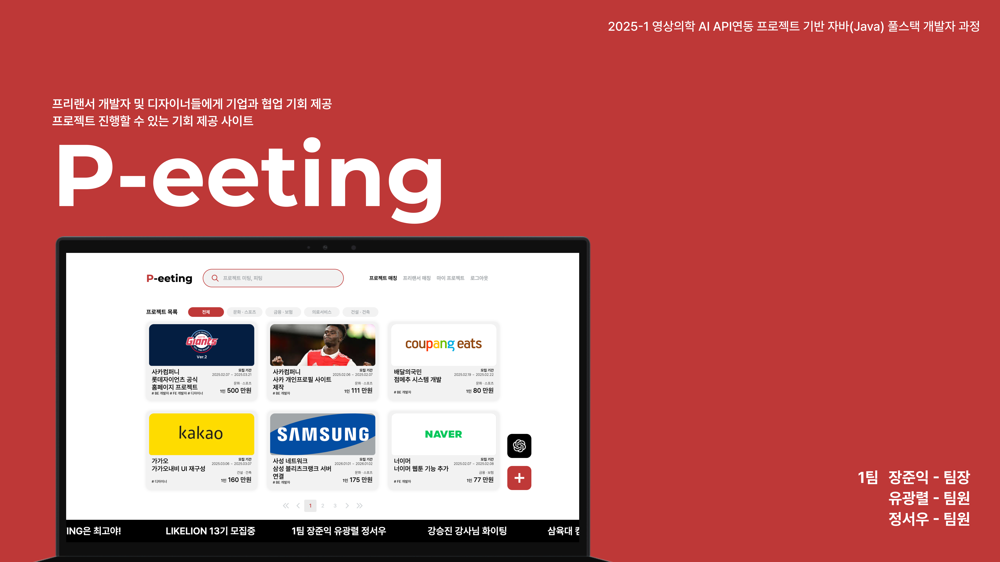

# P-eeting (Project + Meeting)

  
## 🧑‍💻 멤버

|  이름  |          [장준익](https://github.com/No4hh4oN)          |              [정서우](https://github.com/8woes)               |                [유광렬](https://github.com/ryeol00)                |
| :----: | :----------------------------------------------------------------: | :---------------------------------------------------------------: | :----------------------------------------------------------------: |
| 프로필 |  |  |  |
|  역할  |                     |                    |                   |

## 📌 프로젝트 소개  
P+eeting은 프로젝트를 찾고자하는 프리랜서 개발자들과, 그들에게 프로젝트를 의뢰하고자 하는 기업들간의 양방향 프로젝트 매칭을 제공하는 서비스입니다.  

## 🚀 주요 기능  
- ✅ **P+eeting 챗봇 기능**: 챗봇 기능을 통해 프리랜서 개발자들에게 본인의 상황에 맞는 프로젝트를 추천해줄 수 있다.  
- ✅ **프로젝트 공고 등록**: 단체 회원(기업)은 요구 개발 스택, 카테고리 등의 조건을 설정하여 프로젝트 공고를 등록한다.  
- ✅ **프로젝트 매칭**: 개인 회원(프리랜서)은 본인에게 맞는 프로젝트를 선택하여 지원할 수 있고, 해당 프로젝트를 등록한 단체 회원은 지원자들 중 조건에 맞는 사람의 신청을 수락한다.  
- ✅ **프리랜서 프로필 등록**: 개인 회원(프리랜서)은 본인의 개인 정보 및 이력등을 포함하여 개인 프로필을 등록할 수 있고, 이를 단체회원이 열람하여 프로젝트 신청 수락에 참고할 수 있다.   

## 🛠️ 기술 스택

### 🎨 기획 & 디자인  

### 🖥️ Frontend  

### 회원가입
- 트랙 선택 및 개인 / 단체 여부 선택 후 회원 가입

### 프리랜서(개인 회원) 
- 로그인 후 마이 프로젝트에서 개인 프로필 등록
- 메인화면에서 지원하고자 하는 프로젝트 선택 후 지원 댓글 작성
- 메인화면 - 챗봇 버튼 클릭 후 챗봇에 프로젝트 관련 질문 가능   

### 기업(단체 회원)
- 로그인 후 메인화면에서 + 버튼 선택 후 프로젝트 공고 생성
- 메인화면에서 본인의 프로젝트 공고를 선택 후 지원자들의 지원 댓글 수락/거절 여부 선택
- 프리랜서 매칭에서 지원한 프리랜서의 프로필 확인 가능
   

